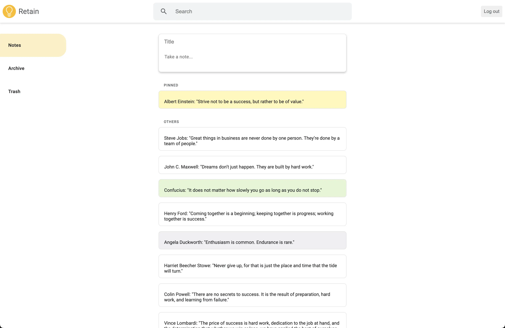
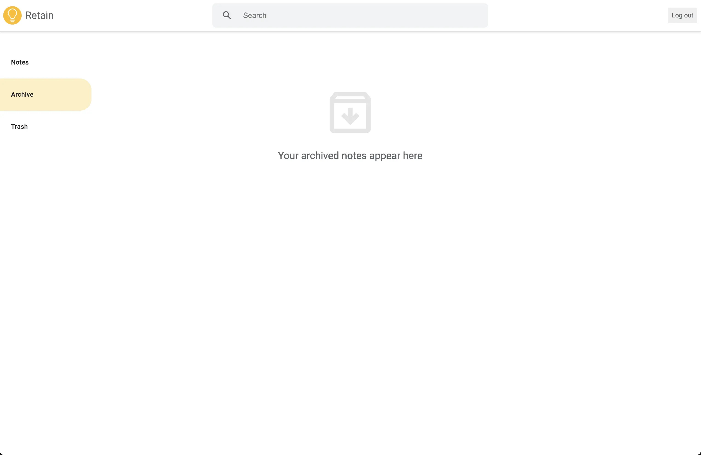
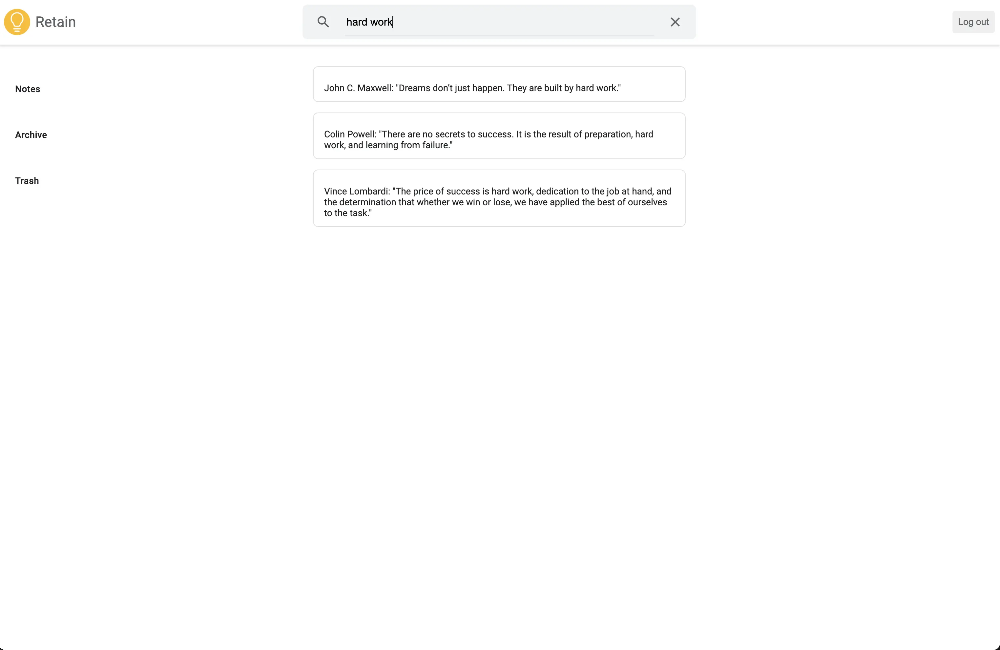
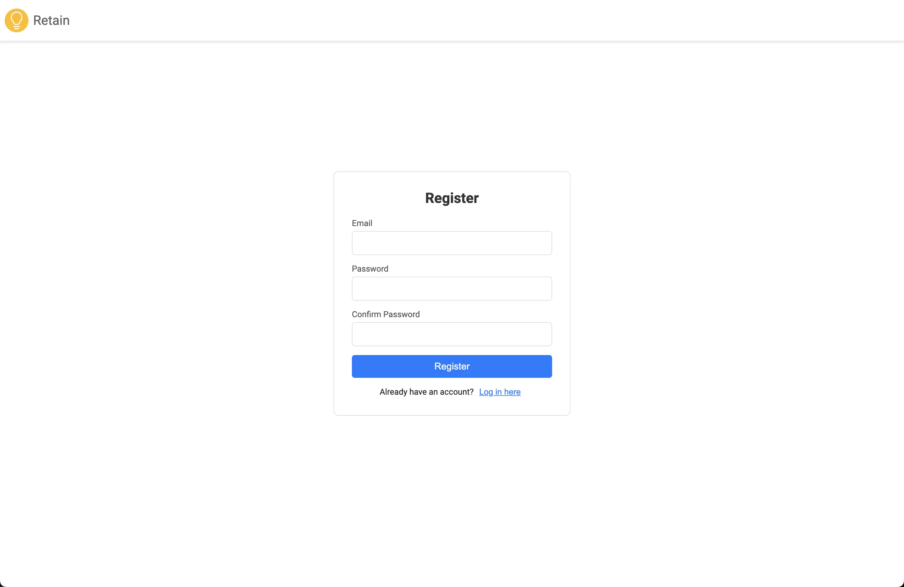
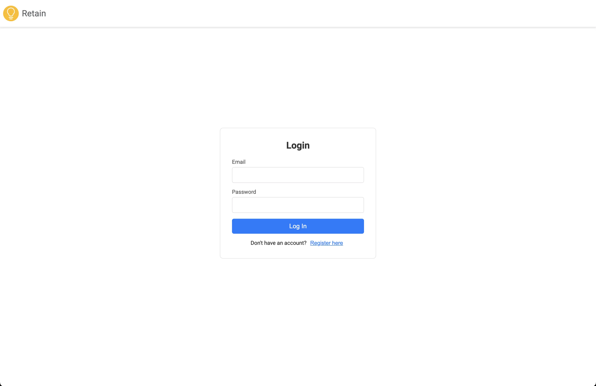
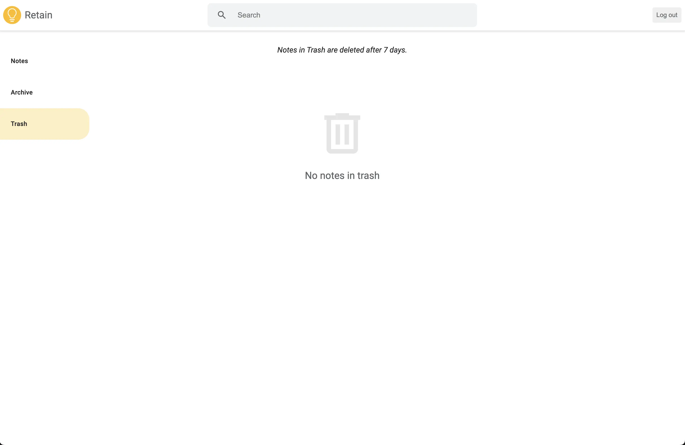
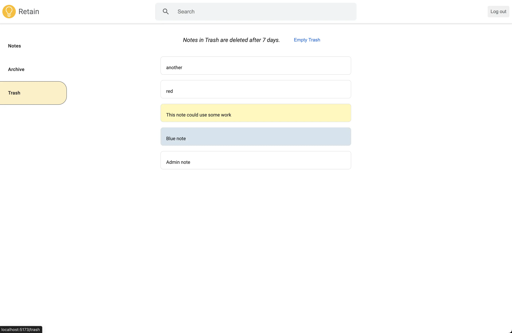

# retain

### Description

A clone of the popular online notetaking app, Google Keep









### Usage/deployment to production

```bash
cd path/to/repo
./deploy/deploy.sh
```

### Motivation

I wanted to have a good, solid crud application that I can show off. I also wanted to practice using Express as a backend, and Prisma as an ORM, then having that API interface with a React front end.

### Features

- Create notes
- Edit notes
- Pin notes to the top for easy access
- Color notes to organize and increase visibility
- Archive notes that you don't need immediately accessible
- Delete notes you no longer need
- Recover notes from the trash
- Delete notes from the trash forever manually
- Automatically deletes notes from the trash every 7 days

### Remaining Features to Build

I ended up deciding it was polished enough as is, but if I had more time to keep working on it, here's what I would add.

- Custom card ordering
- Card labels
- Auto-save
- Mobile friendliness (currently optimized for desktop)

### Learnings

This was one of my first projects of trying out CSS modules. They are nice, but for the scope of my small project I just found that it was creating more organizational work with creating a bunch of separate styling files for each component. I switched over to just using a global stylesheet given the small size of the project and how many of the styles could be reused across components. I could see the use case for CSS Modules for a larger project, especially one with multiple active developers.

This project was a great opportunity to build my understanding of cron jobs. We needed to implement cron jobs because the system needed to permanently delete notes every 7 days, and that was a perfect use case for a cron job. I could have set up an isolated cron job on my server, but I realized it would be much easier to maintain if I used `node-cron` then essentially just set up the cron job to be maintained right alongside my other endpoints. It worked wonderfully!
